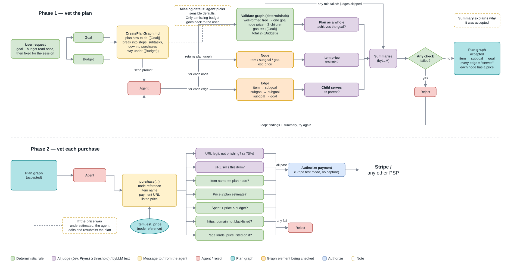

# Countersign MCP

An MCP server that lets an AI agent spend money, but only after its plan and every purchase pass vetting.



## Core features

1. **Two-level vetting.** First the whole plan is vetted: the agent breaks the goal into a graph (item → subgoal → goal) with a price on every node. Then each individual purchase is vetted against that accepted plan.
2. **AI judges plus deterministic rules.**
   - **Provable guarantees** for anything that is arithmetic or a lookup: a node's price is the sum of its children, the total and cumulative spend stay within budget, an item can't cost more than its estimate, the URL uses https and isn't blacklisted, and the price is actually listed on the page.
   - **Strong empirical guarantees** from an LLM judge ([Jev](https://typesafe.ai)) for anything that needs judgment: whether this is the right item, whether the URL is a legitimate merchant or a phishing site, and whether each step serves its parent. Each is an independent check that passes only when P(yes) clears its threshold. A judge that errors counts as a fail.

An approved purchase is authorized (not captured) in Stripe test mode.

## Use the deployed MCP

```
claude mcp add --transport http countersign https://countersign-rdjo.onrender.com/mcp
```

Or, in any MCP client config:

```json
{ "mcpServers": { "countersign": { "type": "http", "url": "https://countersign-rdjo.onrender.com/mcp" } } }
```

Then ask your agent for something with a budget, for example *"Host a dinosaur party for 10 kids, pizza is handled, under $150"*. The agent plans and buys on its own. The server's vetting is the safety check.

## Tools

The agent calls them in this order. `submit_plan` and `purchase` return `{"ok": false, "error": "No goal yet. ..."}` until `get_plan_instructions` has been called. The server keeps one mandate per MCP session. It ends when every item is bought or after 6 hours.

### 1. `get_plan_instructions(request: str) -> str`

Pass the user's request verbatim. The server reads the goal and budget from it once, and they stay fixed for the session. The response is the planning prompt ([prompts/CreatePlanGraph.md](prompts/CreatePlanGraph.md)) filled in with that goal and budget.

```json
{ "request": "Host a dinosaur party for 10 kids, pizza is handled, under $150" }
```

```text
Mandate: Host a dinosaur party for 10 kids, budget $150.00 (USD). Tell the user this budget.

# Create a plan graph
Plan how to achieve this goal: **Host a dinosaur party for 10 kids** ...
```

If the request has no budget, the response is: `No budget found in the request. Ask the user for their total budget in USD, ...`

### 2. `submit_plan(nodes: list[dict], edges: list[dict]) -> dict`

- `nodes`: `{id, kind: "item" | "subgoal" | "goal", name, price}`.
- `edges`: `{child, parent}`. Allowed directions are item → subgoal, subgoal → subgoal, and subgoal → goal.
- The goal node's `name` must equal the mandated goal exactly.

Resubmitting replaces the accepted plan. Use it when an item costs more than its estimate.

```json
{
  "nodes": [
    {"id": "goal",  "kind": "goal",    "name": "Host a dinosaur party for 10 kids", "price": 60},
    {"id": "decor", "kind": "subgoal", "name": "Dinosaur decorations",              "price": 60},
    {"id": "balloons", "kind": "item", "name": "Dinosaur balloon set, 40 pack",     "price": 25},
    {"id": "banner",   "kind": "item", "name": "Dinosaur birthday banner",          "price": 35}
  ],
  "edges": [
    {"child": "decor", "parent": "goal"},
    {"child": "balloons", "parent": "decor"},
    {"child": "banner", "parent": "decor"}
  ]
}
```

```json
{
  "accepted": true,
  "summary": "Accepted: the decorations fit a dinosaur party, prices are realistic, total $60 of $150.",
  "findings": [
    {"kind": "rule", "check": "Each price equals the sum of its parts", "node": null, "ok": true, "detail": "passed"},
    {"kind": "jev", "check": "Estimated price is realistic", "node": "banner", "ok": true,
     "detail": "P(yes) 91%, needs 50%", "p": 0.91, "threshold": 0.5, "question": "...", "model": "jev-latest", "ms": 150}
  ]
}
```

Each check produces one finding. On a rejection, `accepted` is `false`, and the failed findings and the `summary` say what to fix. If any fixed rule fails, the AI judges don't run.

### 3. `purchase(node_id: str, item_name: str, payment_url: str, price: float) -> dict`

Buys one item node of the accepted plan.

- `item_name` must match the node's name.
- `price` is the USD price listed at `payment_url`. The server fetches that page, so the page must load and must list that price.
- Each item can be bought once.

```json
{
  "node_id": "banner",
  "item_name": "Dinosaur birthday banner",
  "payment_url": "https://www.partycity.com/dinosaur-birthday-banner",
  "price": 12.99
}
```

```json
{
  "approved": true,
  "findings": [
    {"kind": "rule",   "check": "Price is at most the plan estimate",  "node": "banner", "ok": true, "detail": "passed"},
    {"kind": "source", "check": "This price is listed on that page",   "node": "banner", "ok": true, "detail": "passed"},
    {"kind": "jev",    "check": "Legitimate merchant, not a scam",     "node": "banner", "ok": true, "detail": "P(yes) 96%, needs 70%", "...": "..."}
  ],
  "payment_intent": "pi_3Q...",
  "status": "requires_capture",
  "spent": 12.99,
  "remaining": 137.01,
  "image": "https://.../banner.jpg"
}
```

A rejected purchase comes back as `{"approved": false, "findings": [...]}`, with the failed findings' `detail` explaining why, for example `price 39.0 exceeds estimate 35.0; edit the plan graph and resubmit it`. A request that can't be vetted at all returns an `error` field instead, for example `'cake' is not an item in the accepted plan` or `'banner' already purchased (pi_...)`.

## Run locally

Requires Python 3.13.

```
pip install jaclang
jac install
```

Create a `.env` file:

```
MISTRAL_API_KEY=...            # summaries, reading the goal and budget
JEV_API_KEY=...                # yes/no judgments
STRIPE_SECRET_KEY=sk_test_...  # test-mode keys only
```

For a local stdio server, add it to Claude Code:

```
claude mcp add countersign -- jac run /path/to/payment-mcp-jac/mcp_server.jac
```

For a local HTTP server at `http://localhost:8000/mcp`, run:

```
PORT=8000 jac run mcp_server.jac
```

To run the web UI (the agent, a live purchase graph, and why each check passed or failed), use `jac start --dev main.jac`. To run the tests, use `jac test -d services`.
